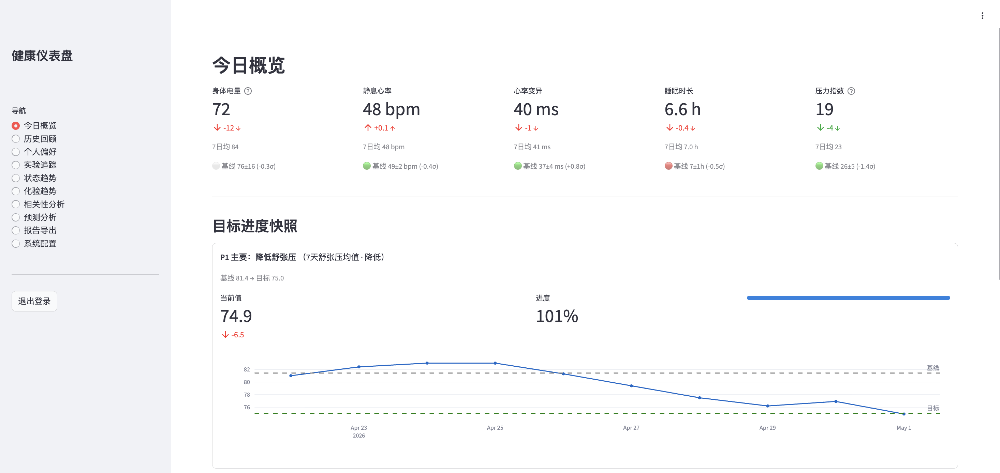

# SuperHealth

[](https://www.python.org/downloads/)
[](LICENSE)
[](https://github.com/chasezjj/superhealth/actions/workflows/ci.yml)

**AutoResearch × 个人智能健康管理系统**

> **不是千人一面的建议——是一个真正了解你、持续学习你、终生陪伴你的健康闭环。**

大多数健康 App 只是记录数据。SuperHealth 做的是另一件事：**以你的目标为核心，读懂你的基因、体检和每次门诊，结合每天的睡眠、压力、运动，由 AI 量身定制方案——再从每次执行反馈中持续优化，越用越懂你。**

---

> **真实验证** · P1 目标：降低舒张压
>
> 按照系统给出的运动建议，**一周内舒张压从 81.4 mmHg 降至 74.9 mmHg（↓ 7.9%）**

---



> 查看示例输出：[每日健康日报](examples/daily_report_example.md)

---

## AutoResearch：目标驱动的自学习闭环

SuperHealth 的核心不是一个工具，而是一个**完整的自学习闭环**。五个步骤环环相扣，系统在每次迭代中持续进化：

```
        你的目标（高血压 / 高血糖 / 高血脂 / 身体电量 / HRV / 体脂……）
                             │
        ┌────────────────────▼────────────────────┐
        │                                          │
   ① 采集                                    ⑤ 学习改进
 多源健康数据                              贝叶斯偏好学习
 Garmin / 血压 / 体重                      N-of-1 干预实验
 基因 / 体检 / 门诊                        策略持续优化
        │                                          │
        ▼                                          ▲
   ② 分析                                    ④ 跟踪
 健康画像自动构建                          执行反馈采集
 9维评估模型激活                           目标进展快照
 因果推断引擎                              运动效果归因
        │                                          │
        └─────────────► ③ 建议 ◄─────────────────┘
                      权威指南 × 个人基线
                      LLM 个性化建议
                      日历感知 × 实验约束注入
```

**支持的目标类型**：
- **慢性病改善**：高血压、高血糖、高血脂、高尿酸血症、体重管理
- **日常精力优化**：身体电量、HRV、睡眠质量、压力水平、静息心率

---

## 三大核心差异

### ① 目标驱动，全链路个性化

设置目标后，**整个系统围绕你的目标联动**：评估模型强制激活目标相关维度，LLM 提示词注入目标优先级，效果追踪对目标指标加权 1.5×，干预实验绑定目标设计。结果是每天的建议都在真正推进你的目标，而不是泛泛的"多喝水、早睡觉"。

### ② 越用越懂你，成为终生健康顾问

系统管理你**一生的健康数据**——基因报告只需上传一次，每次体检 / 门诊记录自动丰富你的画像，每日穿戴数据持续积累。数据越多，画像越精准，建议越个人化。所有数据本地存储（SQLite），不上传云端，你的隐私永远属于你。

### ③ 权威指南 × 个人历史基线

慢性病风险模型直接引用中国最新临床指南（2024 年高血压、2024 年糖尿病、2023 年高尿酸血症）。健康评估**不与"平均人"比较**，而是锚定你自己过去 90 天的滚动基线——让你清楚知道今天的状态相对于"你的正常"是好是坏。

---

## 健康数据管理

三层数据架构，覆盖你整个生命周期的健康信息：

| 层级 | 数据内容 | 更新频率 | 采集方式 |
|------|----------|---------|---------|
| **基因层** | 23andMe / 微基因报告，遗传风险标记 | 终生一次 | 手动上传 Markdown |
| **医疗层** | 年度体检、门诊记录、住院病历、化验单、眼科 / 超声检查 | 月 / 季度 | 手动录入 + 自动解析 |
| **日常层** | Garmin（睡眠 / HRV / 心率 / 压力 / 步数 / 身体电量），血压 / 体重 / 体脂 | 每日 | 全自动采集 |

数据越积累，系统越了解你的个人规律——什么样的运动对你有效、什么时段你的恢复最好、哪些因素在拉高你的血压。这是传统健康 App 做不到的事。

---

## 算法介绍

### 1. 自动健康画像构建

*`core/health_profile_builder.py`*

系统自动从所有数据源提取并整合你的健康画像，无需手动配置：

- **解析来源**：基因报告 Markdown、年度体检报告、门诊记录、用药记录、化验趋势、眼科 / 肾脏超声
- **输出内容**：当前疾病 / 慢性病清单、遗传风险因子、运动禁忌（如青光眼患者不能做 Valsalva 动作）、活跃目标、已习得的个人偏好

每次日常数据更新，画像自动重建，确保建议始终反映你的最新状态。

---

### 2. 9 维自适应评估引擎

*`core/model_selector.py` + `core/assessment_models.py`*

9 个专项评估模型根据健康画像和活跃目标**动态激活**，不是固定套餐：

| 模型 | 评估维度 | 激活条件 |
|------|---------|---------|
| 恢复力 | 睡眠 30% + HRV 25% + 身体电量 20% + 静息心率 15% + 压力 10% | 始终激活 |
| 心血管 | 血压分级 + 静息心率 + BMI + 家族史 | 高血压目标 / 心血管风险 |
| 代谢 | 尿酸趋势 + 血脂 + 肥胖 | 高尿酸 / 代谢目标 |
| 血脂 | TG / LDL-C / 趋势 / 体重变化 | 高血脂目标 |
| 青光眼 | 眼压 + C/D 比 + 用药依从 | 青光眼病史 |
| 睡眠 | 睡眠分级 + HRV 恢复 | 睡眠目标 / 压力过高 |
| 体成分 | 体重趋势 + 体脂率 + BMI | 体重 / 体脂目标 |
| 压力 | 压力评分 + 日历繁忙度 | 压力过高 |
| 遗传风险 | 基因标记 × 当前指标 | 有基因报告 |

所有评分均锚定**个人 90 天滚动基线**（z-score），而非人群均值。

---

### 3. 慢性病风险量化

*`dashboard/prediction/`* — 基于权威临床指南

| 疾病 | 指南依据 | 核心因子 |
|------|---------|---------|
| **高血压** | 中国高血压防治指南 2024 | 血压分级 + 5项危险因素 + 器官损害 + 合并症，查表定级 |
| **高尿酸血症** | 中国高尿酸血症与痛风诊疗指南 2023 | 尿酸分级 + 触发因子（寒冷 / 剧烈运动 / 快速减重）+ 合并症 |
| **高血脂** | 中国血脂异常防治指南 | TG 30% + LDL-C 30% + 趋势 20% + 体重变化 10% + 检测间隔 10% |
| **高血糖 / T2DM** | 中国2型糖尿病防治指南 2024 | 空腹血糖 + HbA1c + 家族史 + 肥胖 + 年龄 |

**7 天趋势预测**：基于 14 天线性回归，输出 7 天预测值 + 95% 置信区间。

---

### 4. 匹配对照效果归因

*`feedback/effect_tracker.py`*

传统方式无法区分"今天恢复好"是因为昨天运动，还是因为昨天睡得好。SuperHealth 使用**匹配对照法**：

1. 提取运动日数据
2. 在历史中找 3 个"最接近的不运动日"（HRV / 睡眠 / 压力 / 日程繁忙度相似）作为对照
3. **净运动效果 = 运动日恢复曲线 − 对照基线**
4. 自动排除污染日（高压力事件 / 饮酒 / 疾病）
5. 目标相关指标效果权重 ×1.5

这使系统能科学地判断：**哪种运动真正对你有效**，而不是被噪音误导。

---

### 5. 贝叶斯偏好学习

*`feedback/strategy_learner.py`*

系统从每次执行反馈中持续学习你的个人运动偏好：

- **学习维度**：运动类型 × 时长档位（15–30 / 30–45 / 45–60+ 分钟）× 心率区间（Z1–Z5）× 时间段（晨 / 午 / 晚）× HRV 状态（高 / 中 / 低）
- **Bayesian shrinkage**：防止稀疏数据过拟合，需要至少 8 次证据才更新偏好
- **偏好生命周期**：活跃 → 巩固（质量分 ≥ 0.70）/ 回退（质量分 ≤ 0.30）
- **质量分**：0.30 × 依从度 + 0.25 × 目标进展 + 0.25 × 效果 + 0.20 × 用户评分

学到的偏好会**注入 LLM 提示词**，让每天的建议越来越符合你的实际情况。

---

### 6. N-of-1 个人干预实验

*`feedback/experiment_manager.py`*

当你想验证某个干预是否真的有效，系统提供完整的**自我实验框架**：

- **内置干预库**：高血压（等长握力训练 / 哈他瑜伽 / 太极拳 / 有氧训练 / 靠墙蹲）、HRV（晨间有氧 / 4-7-8 呼吸 / 冷水暴露）、睡眠（固定作息 / 睡前仪式 / 晨间光照 / 禁午后咖啡因）等
- **实验周期**：14–28 天，一次只进行一项实验（防止干预混淆）
- **统计评估**：Granger 因果检验 + 间断时间序列分析（ITSA）+ Welch t 检验 + Cohen's d
- **实验结论**：统计显著且方向正确 → 固化为个人偏好；方向反转 → 标记回退；不确定 → 自动延长 7 天

实验结论持续影响后续 LLM 建议，让策略建立在你自己的证据上。

---

## OpenClaw 集成

[OpenClaw](https://github.com/open-claw/openclaw) 是开源消息推送框架，SuperHealth 通过它将每日健康报告**自动推送到微信**，让你随时随地拥有一个健康助理。

**配置只需两步**：

```toml
# ~/.superhealth/config.toml
[wechat]
target_openid = "your_openid"
account_id    = "your_account_id"
```

每天自动运行后，你会在微信收到一份结构化的晨间健康报告，包含：当日恢复力评分、目标进展、运动建议、风险提醒、日程匹配的强度建议。

---

## 特性清单

- **多源数据采集**：Garmin Connect（Playwright 自动化）、Health Auto Export（REST）、和风天气 API、Outlook / Exchange 日历（EWS）
- **本地优先存储**：SQLite 20 张表，数据不离开你的设备
- **双 LLM 支持**：Anthropic Claude / 百川医疗大模型，支持并行调用对比
- **智能评估引擎**：9 个维度，目标驱动动态激活，个人90天基线评分
- **风险预测模型**：4 种慢性病风险评分（权威指南）+ 7 天趋势预测
- **阶段性目标系统**：11 个白名单指标，目标驱动全链路联动
- **反馈闭环学习**：自动采集依从度 → 效果追踪 → 贝叶斯偏好学习
- **N-of-1 干预实验**：自我实验设计、执行、统计评估
- **就医提醒系统**：自动推算复诊日期，14 / 7 天阈值提醒
- **Web 仪表盘**：Streamlit 9 个子页面，趋势图表、化验对比、PDF 导出
- **OpenClaw 集成**：微信每日晨报推送

---

## 快速开始

### 安装

```bash
git clone https://github.com/chasezjj/superHealth.git
cd superhealth
pip3 install -e ".[all,dev]"   # 安装所有可选依赖（含测试工具）
playwright install chromium    # 仅 Garmin 数据采集需要，不用 Garmin 可跳过
```

<details>
<summary>按需安装可选依赖</summary>

```bash
pip3 install -e "."               # 仅核心功能
pip3 install -e ".[garmin]"       # + Garmin 数据采集
pip3 install -e ".[claude]"       # + Claude AI 建议
pip3 install -e ".[baichuan]"     # + 百川 AI 建议
pip3 install -e ".[dev]"          # + 开发工具 (pytest, ruff, mypy)；运行 pytest 必须安装此项
```

</details>

### 配置

```bash
mkdir -p ~/.superhealth
cp examples/config.example.toml ~/.superhealth/config.toml
chmod 600 ~/.superhealth/config.toml
# 编辑 config.toml 填入实际值
```

### 初始化数据库

```bash
python -c "from superhealth.database import init_db; init_db()"
# 数据库文件默认创建在项目根目录 health.db
# 可通过 SUPERHEALTH_DB 环境变量自定义路径，例如：
# export SUPERHEALTH_DB=~/.superhealth/health.db
```

### 导入示例数据（可选）

```bash
sqlite3 health.db < examples/sample_data.sql
```

### 启动 Web 仪表盘

```bash
PYTHONPATH=src streamlit run src/superhealth/dashboard/app.py --server.port=8505
# 浏览器访问 http://localhost:8505
```

### Docker 部署

```bash
docker compose up -d
# 浏览器访问 http://localhost:8505
```

---

## 常用命令

```bash
# 每日流水线（cron 主入口）
PYTHONPATH=src python -m superhealth.daily_pipeline

# 单独运行数据采集
PYTHONPATH=src python -m superhealth.collectors.fetch_garmin
PYTHONPATH=src python -m superhealth.collectors.weather_collector

# 生成日报
PYTHONPATH=src python -m superhealth.reports.daily_report --date 2025-04-01
PYTHONPATH=src python -m superhealth.reports.advanced_daily_report --date 2025-04-01

# 阶段性目标管理
PYTHONPATH=src python -m superhealth.goals list
PYTHONPATH=src python -m superhealth.goals add --name "降血压" --priority 1 \
  --metric bp_systolic_mean_7d --direction decrease --target 120

# 趋势分析与相关性
PYTHONPATH=src python -m superhealth.analysis.trends
PYTHONPATH=src python -m superhealth.analysis.correlation

# 就医提醒
PYTHONPATH=src python -m superhealth.reminders.appointment_scheduler --dry-run
PYTHONPATH=src python -m superhealth.reminders.reminder_notifier --dry-run
```

---

## 目录结构

```
superhealth/
├── src/superhealth/          # Python 核心包
│   ├── config.py             # 配置管理
│   ├── models.py             # Pydantic 数据模型
│   ├── database.py           # SQLite 存储层（20 张表）
│   ├── collectors/           # 数据采集层
│   ├── api/                  # 数据接收端
│   ├── analysis/             # 分析工具（趋势 / 相关性 / 因果推断）
│   ├── core/                 # 健康画像与决策引擎
│   ├── reports/              # 报告生成
│   ├── goals/                # 阶段性目标子系统
│   ├── feedback/             # 反馈闭环与学习层
│   ├── insights/             # 周期性洞察
│   ├── reminders/            # 就医提醒系统
│   ├── tracking/             # 用药追踪
│   └── dashboard/            # Web 仪表盘（Streamlit，9 个子页面）
├── tests/                    # pytest 测试
├── examples/                 # 示例配置与脱敏数据
│   ├── config.example.toml
│   ├── sample_data.sql
│   └── daily_report_example.md  # 每日健康日报示例输出
├── scripts/                  # cron 脚本
├── docs/                     # 项目文档
├── schema.sql                # 数据库 Schema（单一来源）
└── pyproject.toml            # 项目元数据与依赖
```

---

## 开发

```bash
pip3 install -e ".[dev]"
pytest
ruff check src/
mypy src/ --ignore-missing-imports
```

## 贡献

欢迎贡献！请参阅 [CONTRIBUTING.md](CONTRIBUTING.md)。

---

## 常见问题

<details>
<summary>Garmin 登录失败怎么办？</summary>

确保使用中国区 Garmin Connect 账号。运行 `python -m superhealth.collectors.fetch_garmin --login` 进行交互式登录。如果 Playwright 安装失败，尝试 `playwright install-deps chromium` 安装系统依赖。

</details>

<details>
<summary>如何只使用部分功能？</summary>

所有集成模块都是可选的。未配置的模块会静默跳过。例如，不配置 Garmin 凭据则跳过数据采集，不配置 Claude API 则跳过 LLM 建议。

</details>

<details>
<summary>数据存在哪里？</summary>

所有数据保存在本地 `health.db`（SQLite）中，不会上传到任何云服务。LLM API 调用会发送当日健康摘要以获取建议，但不发送历史原始数据。

</details>

---

## 许可证

[MIT](LICENSE)

## 免责声明

本系统提供的所有健康建议仅供参考，不替代专业医疗诊断。如有健康问题，请咨询专业医生。

---

<details>
<summary>English Introduction</summary>

## SuperHealth — AutoResearch × Personal AI Health Coach

> Not generic advice. A system that learns **you** — your genes, your history, your responses — and gets smarter with every day you use it.

### The AutoResearch Closed Loop

SuperHealth is built around a **self-learning closed loop**: it doesn't just give advice; it tracks whether the advice worked, learns from the outcome, and refines the next recommendation.

```
        Your Goal (Blood Pressure / Blood Sugar / Energy / HRV / Weight…)
                             │
        ┌────────────────────▼────────────────────┐
        │                                          │
   ① Collect                               ⑤ Learn
 Multi-source data                    Bayesian preference learning
 Garmin / BP / Weight                 N-of-1 experiments
 Genes / Checkups / Records           Continuous strategy refinement
        │                                          │
        ▼                                          ▲
   ② Analyze                               ④ Track
 Auto health profile                  Feedback collection
 9-model adaptive engine              Goal progress snapshots
 Causal inference                     Exercise effect attribution
        │                                          │
        └────────────────► ③ Advise ◄─────────────┘
                     Clinical guidelines × personal baseline
                     LLM-personalized advice
                     Calendar-aware + experiment constraints
```

### Key Algorithms

| Algorithm | What It Does |
|-----------|-------------|
| **Health Profile Builder** | Auto-parses genes, checkups, records, labs → unified health portrait |
| **9-Model Adaptive Engine** | Dynamically activates relevant assessment models based on your conditions and goals |
| **Guideline-Based Risk Models** | Hypertension (China 2024), Hyperuricemia (China 2023), Dyslipidemia, T2DM — authoritative clinical standards |
| **Matched-Control Attribution** | Finds 3 historical no-exercise days as controls to isolate true exercise effect from noise |
| **Bayesian Preference Learning** | Learns which exercise type/duration/timing/HR zone actually works for *you* |
| **N-of-1 Experiments** | 14–28 day personal interventions with Granger causality + ITSA + Cohen's d evaluation |

All health scores are anchored to your **personal 90-day rolling baseline**, not population averages.

### Key Features

- **Goal-driven**: The entire system — assessment models, LLM prompts, effect tracking — focuses on your goal
- **Lifelong health data**: Manages genetic reports, annual checkups, outpatient records, and daily wearable data in one place
- **Local-first privacy**: All data stored in SQLite on your device, no cloud upload
- **Dual LLM support**: Anthropic Claude + Baichuan Medical LLM (parallel or single mode)
- **OpenClaw/WeChat integration**: Daily morning health digest pushed to WeChat
- **Web dashboard**: Streamlit, 9 pages — overview, trends, lab results, correlations, risk prediction, experiments, PDF export

### Real-World Validation

> P1 Goal: Lower diastolic blood pressure.
> Following the system's exercise recommendations, **diastolic BP dropped from 81.4 mmHg to 74.9 mmHg within one week (↓ 7.9%)**.

### Quick Start

```bash
git clone https://github.com/chasezjj/superHealth.git
cd superhealth
pip3 install -e ".[all,dev]"
playwright install chromium  # only needed for Garmin collection

mkdir -p ~/.superhealth
cp examples/config.example.toml ~/.superhealth/config.toml
# Edit config.toml with your credentials

python -c "from superhealth.database import init_db; init_db()"
PYTHONPATH=src streamlit run src/superhealth/dashboard/app.py --server.port=8505
```

MIT licensed. All data stays local.

</details>
